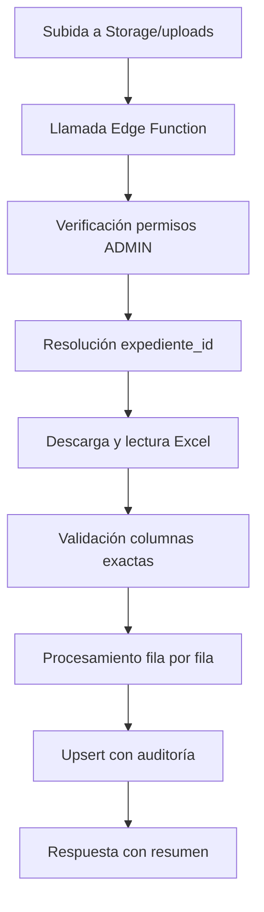

# Fase 6: Importación XLSX - Documentación Técnica

## Overview

La **Fase 6: Importación XLSX** implementa la funcionalidad para importar datos de monitoreo y vuelos desde archivos Excel (.xlsx) al sistema. Esta funcionalidad está restringida exclusivamente a usuarios con permisos **ADMIN**.

## Arquitectura

### Edge Functions (Deno)

#### 1. `import_monitoreo_from_xlsx`
- **Propósito**: Importar puntos de monitoreo desde archivos Excel
- **Input**: 
  - `file_path_or_storage_key`: Ruta del archivo en Supabase Storage
  - `supervision_nombre`: Nombre exacto del expediente
- **Validaciones**:
  - Columnas exactas requeridas: `[LOCACION, COD_CELDA, COD_GRILLA, ESTE, NORTE, PROF, P_SUPERPOS, COD_PUNTO_CAMPO, COD_COLECTORA, DISTANCIA]`
  - Coordenadas UTM17S válidas (ESTE/NORTE numéricos)
  - Códigos de punto obligatorios
- **Proceso**:
  1. Verificación permisos ADMIN
  2. Resolución expediente_id por nombre
  3. Descarga archivo desde Storage/uploads
  4. Validación columnas exactas
  5. Upsert por clave única `(expediente_id, cod_punto_campo)`
  6. Auditoría completa
- **Output**: `{success, inserted, updated, skipped, errors[], message}`

#### 2. `import_vuelos_from_xlsx`
- **Propósito**: Importar ítems de vuelo desde archivos Excel
- **Input**: 
  - `file_path_or_storage_key`: Ruta del archivo en Supabase Storage
  - `supervision_nombre`: Nombre exacto del expediente
- **Validaciones**:
  - Columnas exactas requeridas: `[ITEM, TIPO, CODIGO, ESTE, NORTE, BASE]`
  - Tipo de vuelo válido: `PAF` o `PD`
  - Coordenadas UTM17S válidas
  - Código obligatorio
- **Proceso**:
  1. Verificación permisos ADMIN
  2. Resolución expediente_id por nombre
  3. Descarga archivo desde Storage/uploads
  4. Validación columnas exactas y tipos
  5. Upsert por clave única `(expediente_id, codigo)`
  6. Auditoría completa
- **Output**: `{success, inserted, updated, skipped, errors[], message}`

### Frontend (Next.js + shadcn/ui)

#### Página: `/admin/importar`
- **Componente**: `app/admin/importar/page.tsx`
- **Funcionalidades**:
  - Selector de expediente (dropdown con todos los expedientes activos)
  - Carga dual de archivos (Monitoreo y Vuelos) con tabs
  - Validación de tipos de archivo (.xlsx, .xls)
  - Barra de progreso durante importación
  - Resumen detallado de resultados
  - Manejo de errores con detalles expandibles

#### Navegación
- **Componente**: `components/admin/admin-nav.tsx`
- **Actualización**: Agregado ítem "Importar XLSX" con ícono Upload

## Flujo de Importación

### 1. Preparación
```mermaid
graph TD
    A[Usuario ADMIN selecciona expediente] --> B[Carga archivo(s) XLSX]
    B --> C[Validación frontend: tipo archivo]
    C --> D[Inicio proceso importación]
```

### 2. Procesamiento


### 3. Resumen de Resultados
```typescript
interface ImportResult {
  success: boolean;
  inserted: number;    // Registros nuevos insertados
  updated: number;     // Registros existentes actualizados
  skipped: number;     // Registros omitidos por errores
  errors: string[];    // Lista detallada de errores
  message?: string;    // Mensaje resumen
}
```

## Validaciones Implementadas

### Columnas Excel
- **Monitoreo**: Validación estricta de 10 columnas exactas
- **Vuelos**: Validación estricta de 6 columnas exactas
- **Error si faltan o sobran columnas**

### Datos
- **Coordenadas**: ESTE/NORTE deben ser numéricos válidos UTM17S
- **Códigos únicos**: Por expediente (cod_punto_campo / codigo)
- **Tipos vuelo**: Solo PAF o PD permitidos
- **Campos obligatorios**: Validación según especificaciones

### Seguridad
- **RLS**: Solo usuarios ADMIN pueden importar
- **Autenticación**: JWT válido requerido
- **Auditoría**: Todos los cambios registrados en `auditoria_eventos`

## Base de Datos

### Tablas Afectadas
- **`monitoreo_puntos`**: Upsert por `(expediente_id, cod_punto_campo)`
- **`vuelos_items`**: Upsert por `(expediente_id, codigo)`
- **`auditoria_eventos`**: Registro de todas las operaciones

### Triggers Activos
- **Geometría**: Conversión automática UTM17S → WGS84
- **Auditoría**: Registro automático de cambios
- **Soft Delete**: Protección contra DELETE físico

## Componentes UI

### Creados/Actualizados
- `app/admin/importar/page.tsx` - Página principal de importación
- `components/admin/admin-nav.tsx` - Navegación actualizada
- `components/ui/alert.tsx` - Componente de alertas
- `components/ui/tabs.tsx` - Componente de pestañas

### Dependencias
- **shadcn/ui**: Card, Button, Input, Select, Progress, Badge, Tabs
- **Lucide React**: Iconos (Upload, FileSpreadsheet, CheckCircle, etc.)
- **Sonner**: Notificaciones toast

## Testing

### Casos de Prueba Implementados

#### Edge Functions
- ✅ Verificación permisos ADMIN
- ✅ Validación columnas exactas
- ✅ Manejo errores de archivo
- ✅ Upsert por claves únicas
- ✅ Auditoría completa
- ✅ Respuesta estructurada

#### Frontend
- ✅ Carga de expedientes
- ✅ Validación archivos
- ✅ Progreso de importación
- ✅ Manejo errores
- ✅ Resumen resultados

## DoD (Definition of Done) ✅

### Requisitos Cumplidos
- ✅ **Upsert por claves únicas**: Implementado en ambas Edge Functions
- ✅ **Auditoría guardada**: Registro completo en `auditoria_eventos`
- ✅ **RLS solo ADMIN**: Verificación estricta de permisos
- ✅ **UI de carga**: Interfaz completa con Storage/uploads
- ✅ **Edge Functions**: import_monitoreo_from_xlsx e import_vuelos_from_xlsx
- ✅ **Validación columnas exactas**: Según specs_app.yaml
- ✅ **Resumen importación**: inserted/updated/skipped/errors

## Deployment

### Edge Functions
```bash
# Desplegadas en Supabase
- import_monitoreo_from_xlsx (ID: 72db527c-02a8-46cb-b860-6dcb33dbc4c9)
- import_vuelos_from_xlsx (ID: 5409a997-1535-4825-a7b5-b59cf7b452eb)
```

### Storage
- **Bucket**: `uploads` (configurado para archivos XLSX)
- **Acceso**: Solo usuarios autenticados

## Monitoreo y Logs

### Auditoría
- Todas las operaciones registradas en `auditoria_eventos`
- Incluye: tabla_afectada, registro_id, acción, datos, supervisor_id, timestamp

### Logs Edge Functions
- Disponibles en Supabase Dashboard
- Incluyen errores de validación y procesamiento

## Próximos Pasos

La **Fase 6** está **COMPLETA** y lista para **Fase 7: Detalle Expediente**.

### Preparación Fase 7
- Vista principal de trabajo
- Tabs: Monitoreo | Vuelos | Planificar | Dashboard
- Tabla con filtros (TanStack Table)
- Mapa opcional (MapLibre)
- Exportar XLSX

---

**Fecha**: 2025-08-09  
**Fase**: 6_importacion_xlsx  
**Estado**: ✅ COMPLETADA  
**Próxima**: 7_detalle_expediente
